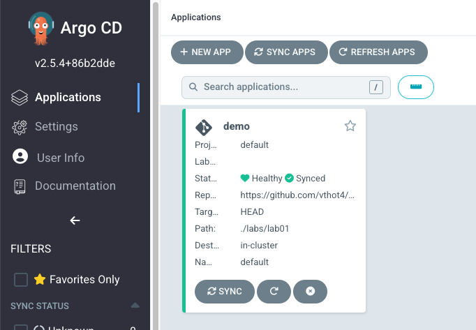
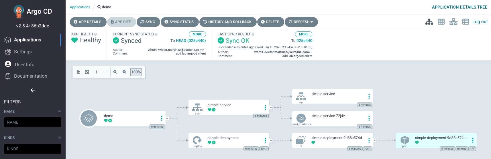
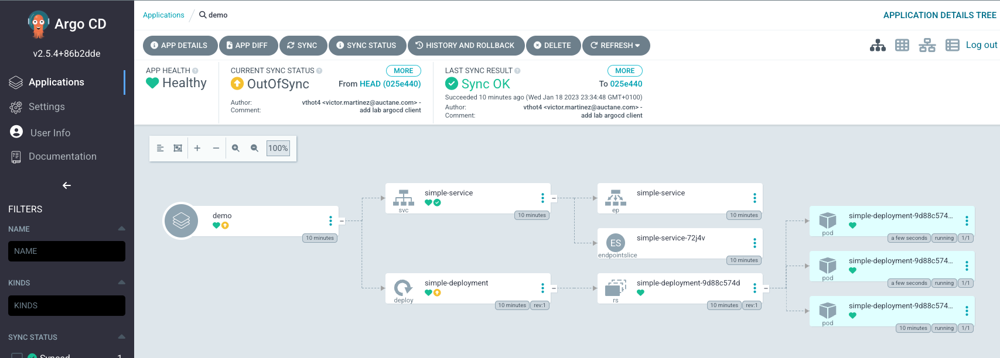

The UI starts empty because nothing is deployed on our cluster. Click the "New app" button on the top left and fill the following details:

- application name : `demo`
- project: `default`
- repository URL: `https://github.com/vthot4/Research-ArgoCD`
- path: `./labs/lab01`
- Cluster: [https://kubernetes.default.svc](https://kubernetes.default.svc/) (this is the same cluster where ArgoCD is installed)
- Namespace: `default`

Leave all the other values empty or with default selections. Finally click the Create button. The application entry will appear in the main dashboard. Click on it.

You should see the following.



We can see the details of the application created by clicking on it. 



Congratulations! Your have setup your first application with GitOps.
However if you check your cluster with

```
(⎈ |kind-argo-cluster:default)╭─victormartinez@mac-MacBook-Pro ~/labs/argocd
╰─$ kubectl get pods
NAME                                READY   STATUS    RESTARTS   AGE
simple-deployment-9d88c574d-nkmsg   1/1     Running   0          8m25s
```

````
(⎈ |kind-argo-cluster:default)╭─victormartinez@mac-MacBook-Pro ~/labs/argocd
╰─$ k scale deployment simple-deployment --replicas 3
deployment.apps/simple-deployment scaled
(⎈ |kind-argo-cluster:default)╭─victormartinez@mac-MacBook-Pro ~/labs/argocd
╰─$ kubectl get pods -w
NAME                                READY   STATUS    RESTARTS   AGE
simple-deployment-9d88c574d-74w9g   1/1     Running   0          6s
simple-deployment-9d88c574d-d2hkn   1/1     Running   0          6s
simple-deployment-9d88c574d-nkmsg   1/1     Running   0          9m51s
```



Apart from UI,ArgoCD also has a CLI. The installation steps are shown below. [Source](https://argo-cd.readthedocs.io/en/stable/getting_started/)

Download the latest Argo CD version from https://github.com/argoproj/argo-cd/releases/latest. More detailed installation instructions can be found via the CLI installation documentation.

Also available in Mac, Linux and WSL Homebrew:

```bash
    brew install argocd
```

We can connect using:  `argocd login`

```bash
(⎈ |kind-argo-cluster:default)╭─victormartinez@mac-MacBook-Pro ~/labs/argocd
╰─$ argocd login localhost:8080                                                       
WARNING: server certificate had error: x509: “Argo CD” certificate is not trusted. Proceed insecurely (y/n)? y
Username: admin
Password:
'admin:login' logged in successfully
Context 'localhost:8080' updated
```

Try the following commands
- `argocd app list`
- `argocd app get demo`
- `argocd app history demo`

````bash
(⎈ |kind-argo-cluster:default)╭─victormartinez@mac-MacBook-Pro ~/labs/argocd
╰─$ argocd app list
NAME  CLUSTER                         NAMESPACE  PROJECT  STATUS  HEALTH   SYNCPOLICY  CONDITIONS  REPO                                       PATH          TARGET
demo  https://kubernetes.default.svc  default    default  Synced  Healthy  Auto        <none>      https://github.com/vthot4/Research-ArgoCD  ./labs/lab01  HEAD
````
```bash
(⎈ |kind-argo-cluster:default)╭─victormartinez@mac-MacBook-Pro ~/labs/argocd
╰─$ argocd app get demo
Name:               demo
Project:            default
Server:             https://kubernetes.default.svc
Namespace:          default
URL:                https://localhost:8080/applications/demo
Repo:               https://github.com/vthot4/Research-ArgoCD
Target:             HEAD
Path:               ./labs/lab01
SyncWindow:         Sync Allowed
Sync Policy:        Automated
Sync Status:        Synced to HEAD (a7c5ad6)
Health Status:      Healthy

GROUP  KIND        NAMESPACE  NAME               STATUS  HEALTH   HOOK  MESSAGE
       Service     default    simple-service     Synced  Healthy        service/simple-service unchanged
apps   Deployment  default    simple-deployment  Synced  Healthy        deployment.apps/simple-deployment configured
```

```bash
(⎈ |kind-argo-cluster:default)╭─victormartinez@mac-MacBook-Pro ~/labs/argocd
╰─$ argocd app history demo
ID  DATE                           REVISION
0   2023-01-18 22:33:19 +0100 CET  HEAD (02ceb24)
1   2023-01-18 22:37:19 +0100 CET  HEAD (02ceb24)
2   2023-01-18 22:40:57 +0100 CET  HEAD (b4b4d8c)
```

```shell
(⎈ |kind-argo-cluster:default)╭─victormartinez@mac-MacBook-Pro ~/labs/argocd
╰─$ argocd app delete demo
Are you sure you want to delete 'demo' and all its resources? [y/n]
y

(⎈ |kind-argo-cluster:default)╭─victormartinez@mac-MacBook-Pro ~/labs/argocd
╰─$ argocd app list
NAME  CLUSTER  NAMESPACE  PROJECT  STATUS  HEALTH  SYNCPOLICY  CONDITIONS  REPO  PATH  TARGET
```

Confirm the deletion by answering yes in the terminal. The application will disappear from the Argo CD dashboard after some minutes.

Now deploy it again.


```shell
(⎈ |kind-argo-cluster:default)╭─victormartinez@mac-MacBook-Pro ~/labs/argocd
╰─$ argocd app create demo2 \                                                                     
--project default \
--repo https://github.com/codefresh-contrib/gitops-certification-examples \
--path "./simple-app" \
--dest-namespace default \
--dest-server https://kubernetes.default.svc
application 'demo2' created
```

The application will appear in the ArgoCD dashboard.